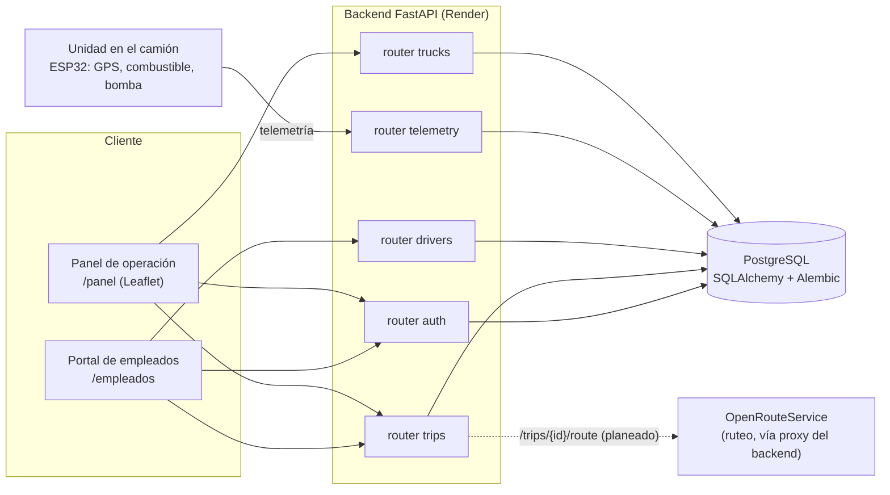

## 2. Arquitectura / componentes

```mermaid
flowchart LR
    subgraph Cliente
        P["Panel de operación<br/>/panel (Leaflet)"]
        E["Portal de empleados<br/>/empleados"]
    end

    subgraph Backend["Backend FastAPI (Render)"]
        A["router auth"]
        T["router trucks"]
        TM["router telemetry"]
        D["router drivers"]
        TR["router trips"]
    end

    DB[("PostgreSQL<br/>SQLAlchemy + Alembic")]
    U["Unidad en el camión<br/>ESP32: GPS, combustible, bomba"]
    ORS["OpenRouteService<br/>(ruteo, vía proxy del backend)"]

    P --> T & TR & A
    E --> D & TR & A
    U -->|telemetría| TM
    T & TM & D & TR & A --> DB
    TR -.->|"/trips/{id}/route (planeado)"| ORS
```
